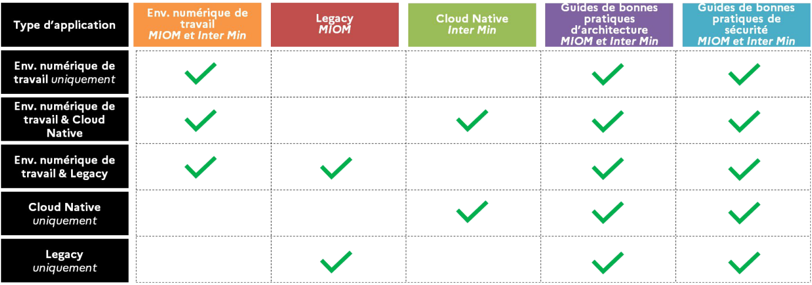
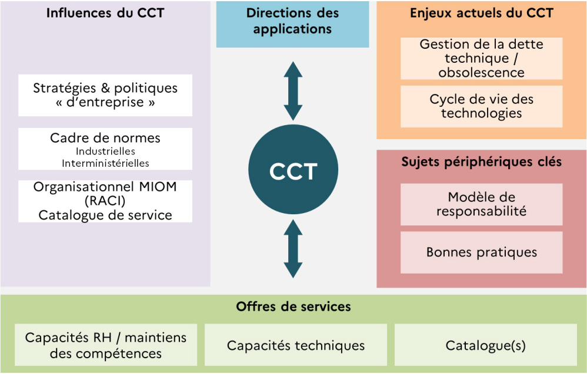
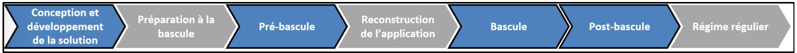

À travers sa doctrine « Cloud au centre », l’État encourage l’ensemble des acteurs publics
à se saisir de son potentiel afin de développer une nouvelle génération de services
numériques de qualité, tout en protégeant au mieux les données des entreprises et des
citoyens français.

Dans le but de disposer un SI adapté et agile, le MIOM a posé un ensemble de normes
techniques et des recommandations de nature, formalisés dans un document de Cadre
de Cohérence Technique (CCT), pour le développement de nouvelles applications
compatibles avec ces normes et hébergées sur son infrastructure, et de services de
qualité qui répondent aux besoins des métiers et déployables rapidement et à coûts
réduits.

Ce document représente le document « chapeau » du Cadre de Cohérence Technique
(CCT) qui vise à faire le lien vers d’autres documents, selon les offres du MIOM et
interministériel, dont chacun d’eux est couplé d’un guide de bonnes pratiques et d’une
liste d’annexes et d’exigences.

Le premier chapitre de ce document décrit le contexte et les objectifs du CCT. Il donne
une visibilité sur son architecture documentaire et son applicabilité selon différents cas d’usages, tout en mentionnant les domaines concernés et les acteurs ciblés ainsi que son utilisation au sein des projets et des processus du MIOM et interministériel. 

Le deuxième chapitre défini le cadre d’applicabilité de ce CCT sur les différentes offres de services avec les usages concernés et le dernier chapitre définit son cycle de vie et sa gouvernance.

Pour un accès rapide aux thèmes du CCT correspondant à votre besoin, vous pouvez
vous référer au tableau ci-dessous.

 

##	Contexte et Objectifs

Dans le contexte actuel de transformation numérique, le SI du MIOM fait face à des nouveaux défis comme la modernisation du système d’information, l’amélioration de la qualité des services numériques et la création de services innovants et des outils numériques de travail collaboratif.
 
Dans le but de disposer un SI adapté et agile, le MIOM a posé un ensemble de normes techniques et des recommandations de nature, formalisés dans un document de Cadre de Cohérence Technique (CCT), pour le développement de nouvelles applications compatibles avec ces normes et hébergées sur son infrastructure, et de services de qualité qui répondent aux besoins des métiers et déployables rapidement et à coûts réduits. Ce type d’applications à l’état de l’art et appelées « Cloud Native » est systématiquement privilégié pour les nouveaux projets et évolutions, dans une stratégie « Cloud First ».

 

 
 

Le CCT, au-delà de ses relations directes avec les applications et offres de service, se trouver au centre d’un écosystème d’influences stratégiques et normatives ascendantes et descendantes. Il vise initialement à répondre aux enjeux de dette technique/obsolescence dont le cycle de vie des technologies.

Ce CCT doit être partagé, visible et évolutif.
Il concourt à fournir à l’utilisateur – qu’il soit citoyen/usager, agent, entreprise ou association - un service numérique de qualité. Cet objectif de qualité doit s'entendre dans toutes ses composantes :
- En termes de qualité logicielle : un service simple et compréhensible, répondant au besoin, accessible à tous, sécurisé, et préservant les données personnelles
- En termes de délai et d'évolutivité : le bon service au bon moment
- En termes de coût : même si en général le service est gratuit, c'est bien l'argent du contribuable qui est mobilisé pour le produire, le maintenir et le faire évoluer
Le CCT du SI a plusieurs objectifs :
- Permettre aux applications de partager dans de bonnes conditions l’infrastructure matérielle et l’infrastructure de communication.
- Permettre aux applications d’interopérer entre elles et avec les partenaires extérieurs. 
- Assurer une bonne pérennité des composants de base par la mise en œuvre de démarches de choix instrumentées, et limiter la variabilité des plates-formes et des configurations.
- Maîtriser les coûts d’acquisition des progiciels et des composants logiciels ainsi que ceux des services d’intégration et d’administration.
- Assurer la maîtrise technique des environnements en limitant la multiplication des technologies et des méthodes.
- Fiabiliser le système d'information en préconisant des briques techniques de sécurité à mettre en œuvre.
Ce CCT chapeau doit permettre aux Concepteurs/Développeurs, architectes, chefs de projet et DevOps de pouvoir identifier immédiatement les documents et règles auxquelles il doit se conformer en fonction des caractéristiques de son application.

## L'Objet

Ce document représente le document « chapeau » du CCT qui vise à faire le lien vers d’autres documents, selon les offres du MIOM et interministériel, dont chacun d’eux est couplé d’un guide de bonnes pratiques et d’une liste d’annexes et d’exigences.
Pour plus de flexibilité dans l’évolution et dans l’applicabilité du CCT, celui-ci est scindé en plusieurs documents dont l’architecture est détaillée dans le chapitre 1.3. Ce document « chapeau » vise à faire le lien vers d’autres documents listés ci-dessous dont chacun d’eux est couplé d’une liste d’annexes et d’exigences.
- Environnements numériques de travail
- Legacy
- Cloud Native
- Guides de bonnes pratiques d’architecture
- Guides de bonnes pratiques de sécurité

## Architecture documentaire et applicabilité selon les cas

Pour des raisons de périmètre et de différences de gouvernance entre les domaines d’exigence, les exigences et recommandations du CCT ont été séparées dans 5 thèmes listés ci-dessous :
- **Environnement numérique de travail** : ensemble de règles et exigences s’appliquant aux applications et SI bureautique du MIOM et à l’interministériel;
- **Legacy** : ensemble de règles et exigences s’appliquant aux applications et SI du MIOM ne pouvant pas être conçus comme étant cloud native (contraintes techniques et / ou légales);
- **Cloud Native** : ensemble des règles et exigences s’appliquant aux applications et SI cloud native à l’interministériel;
- **Guide de bonnes pratiques d’architecture** : ensemble d’exigences non fonctionnelles et de bonnes pratiques d’architecture SI, s’appliquant à l’ensemble des applications et SI du MIOM et Inter Ministériel;
- **Guide de bonnes pratiques sécurité** : ensemble d’exigences non fonctionnelles et de bonnes pratiques de sécurité des SI et des applications hébergées chez l’infrastructure du MIOM et des autres ministères.

Les règles et exigences du CCT s’appliquent différemment selon la constitution de
l’application : a-t-elle une interface « client lourd » ? Une implémentation côté serveur ? Sur Cloud Native ou en Legacy ?
  - Dans le cas d’une nouvelle application ou application existante avec des évolutions majeures (définir ce qu’est une évolution majeure) à intégrer :

*Figure: Les documents du CCT à utiliser en fonction des types d'application*.

  - Dans le cas d’une application existante avec des évolutions mineures (définir ce qu’est une évolution mineure) à intégrer, quelque soit le type de solution (2.a, 2.b,
2.c, 2.d ou 2.e) le cadre d’applicabilité sera revu selon les spécificités de chaque
application et des évolutions.

## Domaines concernés
Le CCT s'intéresse à 5 domaines principaux, ou piliers :
- **L’utilisateur**, – qu’il soit citoyen/usager, agent, entreprise, association – Ce
domaine primordial adresse différents thèmes comme son identification /
authentification / autorisation, l’environnement numérique de travail de l’agent
(ETNA)1, les chaînes de soutien, la qualité et l’accessibilité du service rendu
- **Les données et les API**, patrimoine du SI de l’État et socle sur lequel se fonde le
service rendu à l'utilisateur
- La **sécurité du service** et la protection des données personnelles
- La **fabrique de code** qui traite du "build" au travers des processus d'intégration et de déploiement continu
- L’**hébergement** qui traite du "run" et des problématiques d'hébergement et
d'exploitation
- Les **services transverses** : services de confiance, gestion électronique de courrier, etc.

Dans ces domaines préférentiels :
- Il édicte des règles et des recommandations;
- Il référence les règles « parentes » s’appliquant au MIOM (lois, règlements
européens…);
- Et il référence les composants et offres services portés par les différents acteurs
SIC ministériels ou interministériels. Au-delà d'un référentiel de cadrage, le CCT
se veut un outil de mise en relation entre les producteurs et consommateurs de
ces composants et services.

## Acteurs ciblés

Le CCT a une double portée, ministérielle et interministérielle :
- Ministérielle pour l’ensemble du périmètre des applications et infrastructures
appartenant au ministère
- Interministérielle dans le cas des applications n’appartenant pas au ministère
mais hébergées en son sein. Ce cas s’adresse principalement aux applications
Cloud Natives
Dans ce cadre, les acteurs ciblés par le CCT peuvent être issus du MIOM, d’un autre
ministère et organisme de l’état ou d’un partenaire externe.
Les principaux rôles répertoriés sont les suivants :
- Les propriétaires des applications : référents de l’application qui gèrent son
homologation, maintiennent son registre RGPD…
- Les exploitants / hébergeurs : pour leurs exigences d'exploitabilité
- Les concepteurs / développeurs - qu'ils œuvrent dans les DSI ou dans les directions
métier, au sein du ministère ou avec des prestataires externes. Le CCT les aident
à intégrer leur produit dans l'écosystème ministériel et interministériel
(description des interfaces).
- Les architectes et intégrateurs. Le CCT les aide à s'orienter vers des architectures
à la fois maitrisées par le ministère et les plus appropriées au devenir du SI de l'État
- Les services accompagnant les passations de marché (au travers des clausiers et
de la notation des offres proposés dans le guide mentionné plus haut)

## Utilisation du CCT au sein des projets et des processus

*Figure : Focus sur les utilisations du CCT au sein cycle de vie d’une application*

Le CCT contient des exigences de différents niveaux (bloquant, primordial, important).
A noter que, malgré leur caractère non bloquant, la bonne application des exigences
primordiales et importantes sera évaluée et notée lors de la comparaison de solutions
techniques proposées par les prestataires.
- **Phase de conception** : Pour assurer la bonne prise en compte de ces exigences, il est indispensable de considérer le CCT dès la conception d’une nouvelle application ou au démarrage de la transformation d’une application existante. Et cela avant de démarrer
les travaux de construction.
- **Phase de pré-bascule** : Des contrôles de conformité seront effectués lors des phases de test de l’application. Ceux-ci pourront mener à des réserves à la mise en service de l’application.
- **Phase de bascule et post-bascule** : Si les éventuelles réserves levées lors de la phase de tests ne sont pas levées, la mise en service pourra être bloquée.
Dans le cadre d’applications développées par des partenaires externes et faisant l’objet
d’un marché public, le CCT et sa liste d’exigence devront être joints au CCTP.

## Cadre d’applicabilité

### Usages concernés
Le CCT du MIOM concerne en particulier les modèles de déploiements suivants :
- **Toute application dont le MIOM** est **propriétaire**
- **Toute application dont le MIOM** est l’**hébergeur**

Deux approches sont actuellement possibles pour la mise à disposition des applications :
l’approche « cloud native » et l’approche « legacy » :
1. La première, le Cloud Native, est à privilégier systématiquement lors de la
conception de nouvelles applications et lors de la transformation
d‘applications existantes.
2. La seconde, le legacy, héberge les applications déployées antérieurement et
non compatibles avec les nouvelles normes. Elle ne pourra être utilisée pour
des nouveaux usages que de manière exceptionnelle et dérogatoire.

    |Critères de comparaison|Legacy|Cloud Native|
    |--------|----------|------|
    | **Modèle de responsabilité**|  Responsabilité entièrement portée par le MIOM à partir de l’intégration de l’application, sur le déploiement et l’exploitation| Responsabilité partagée avec une autonomisation du développeur « you build it,you run it »|
    |**Processus de déploiement**| Tests, intégration et déploiement manuels ou semi-automatisés|Tests, intégration et déploiements automatisés Déploiements fréquents |
    |**Exigences et contrôle**|Cadre et exigences sur l’ensemble des couches de l’application Contrôle complet de l’application et infrastructure, homologation de bout en bout| Cadre et exigences focalisés sur les interfaces de l’application et les données exposées Liberté laissée au développeur tant que les interfaces sont respectées|
    |**Consommation service transverse**|Services transverses à mettre en œuvre et intégrer «manuellement»| Intégration native des services sur étagère et automatiquement|
    |**Valorisation de la donnée**|Intégration «manuelle» aux services d’exposition de la donnée|Capacités «sur étagère» et automatisée d’exposition des données|
    |**Observabilité**|Logs non normés, peu ou pas centralisés.|Centralisation systématique du monitoring et des logs de l’infrastructure et des applications permettant une vision 360 sur l’application Normalisation des logs (techniques, métiers, sécurité)|
    |**Processus de run**|Exploitation des applications dans un modèle **«pet»**, configurations manuelles et réparation des incidents au sein des serveurs|Exploitation dans un modèle   **«cattle»**, détection automatisée des problèmes (health check) et reconstruction des containers plutôt que réparation|

  
### Détail sur les contrôles et validation en fonction de l’application

- Pour les grandes applications:
  - Nouvelles applications : un « Go » devrait être donnée, après étude
approfondie de la solution par le comité d’architecture
      - Modifications/évolutions majeures : un « Go » devrait être donnée, après étude approfondie de la modification et l’impact sur la solution globale,
par le comité d’architecture
      - Modifications/évolutions mineures : un « Go » devrait être donnée, après étude approfondie de la modification/évolution proposées
  - Pour les petites applications:
      - Nouvelles applications : un « Go » devrait être donnée, après étude
approfondie de la solution par le comité d’architecture (voir lien avec gouvernance ?),
      - Modifications / évolutions majeures ou mineures : les responsables
applicatifs effectuent l’étude en autonomie et s’engagent à respecter le CCT
    
# Cycle de vie du CCT et gouvernance

La gouvernance du CCT s’appuie sur un comité, le comité d'architecture. Celui-ci est
animé par la DNUM. Le comité est collégial, constitué de référents mandatés par les
principales sous directions de la DNUM ainsi que des autres acteurs SIC du ministère :
ST(SI)², PP, agences. Chaque référent titulaire peut être backupé par un suppléant. Les
décisions sont prises à la majorité des voix des référents présents (titulaire ou
suppléant).

Au titre de son activité CCT, le comité d’architecture se réunit au moins deux fois par
an pour valider la publication des mises à jour semestrielles du CCT. En dehors de ces
deux réunions annuelles, le comité a toute latitude pour organiser les travaux sous
forme de groupes de travail ad-hoc. Ces groupes de travail peuvent intégrer des
participants n’appartenant au comité. La liste des représentants des différents acteurs
SIC du MIOM, ainsi que la liste des contributeurs au CCT mandatés par le comité, sont
disponibles sur l’espace CCT ministériel.

Contribution du comité d’architecture au CCT : rôle du référent ministériel
Affecté au BPNM (Bureau des Politiques Numériques du Ministère) de la DTNUM/SDID
(Sous-Direction à l'Innovation et de la Donnée), il est chargé de :

  - Pilotage du cadre de cohérence technique ministériel, de la gestion et de
l'animation des groupes de travail et des contributeurs, de la préparation des
réunions du comité CCT
  - L’outillage de la méthode, du processus de contrôle de l'application du CCT et
de la production des livrables
  - Suivi et de la prise en compte des normes et standards
  - La veille technologique sur les composants et produits référencés au CCT
Contribution du comité d’architecture au CCT : les référents des acteurs SIC
Dans le périmètre de leur entité de rattachement, ils sont chargés de :
  - L'animation des groupes de travail internes, le cas échéant
  - Recueil des demandes d'évolution et de la préparation des dossiers présentés en
comité ministériel
  - Contrôle de l'application du CCT
  - L’information au sein de leur entité, et tout particulièrement de la sensibilisation
des chefs de projets

 

:::callout Thèmes
[Après cette saine lecture découvrons les](../blog)
:::


