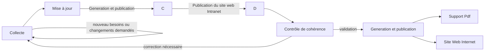

# Manuel de gestion des contenus du CCT

## Processus complet d'intégration et de publication
Le processus est le suivant : 

## Maintien en cohérence du CCT, contrôle et corrections
Le document est contrôlé et maintenu en cohérence par l'equipe d'Architecture d'Entreprise.

Si une erreur est décelée, un relecteur peut soumettre des demandes d'évolutions ou des corrections via [une "issue" publiée sur le dépôt Git](https://github.com/dnum-mi/cct-mi/issues).

## L'édition de contenu
### Qui : Le gestionnaire de contenus
Le CCT est composé d'un ensemble de contenus organisés et dont les porteurs au sein de la DTNUM ont été identifiés. 
Ces porteurs ont pour charge de mettre et de maintenir les contenus qui leur incombent à jour.
Ces porteurs s'engagent à verifier et à modifier, le cas échéant, leurs contenus tous les trois mois.

#### Liste des gestionnaires par contenu

##### Les rubriques portées par la SDID : 

|Zone du CCT|Sous-rubriques|entité responsable|
|-----------|-----|------------------|
|Chapeau|Executive Summmary|------------------|
||Présentation générale|------------------|
||Glossaire|------------------|
||Contribution au CCT|------------------|
||Publication du CCT|------------------|
|Référentiel des normes europeéenes et interministerielles|-----|------------------|
|Doctrine d'hebergement - Cloud Native|CCT Cloud Native|------------------|
||Intégration et déploiement|------------------|
||Exigences d'architecture applicative, composants et services génériques|------------------|
|Environnement numerique de Travail|Introduction|------------------|
||Environnement numérique de travail du développeur|------------------|
|Socle architecture|Contexte utilisateur - Experience utilisateur et accessibilité|------------------|
||Données et API|------------------|

##### Les rubriques portées par la SDAS : 
|Zone du CCT|Sous-rubriques|entité responsable|
|-----------|-----|------------------|
|Doctrine d'hebergement - Cloud Native|Hébergement et exploitation|------------------|
||Exigences d'architecture|------------------|
|Doctrine d'hebergement - Cloud PI|Hébergement et exploitation|------------------|
||Exigences d'architecture|------------------|
|Doctrine d'hebergement - SGAMI|Hébergement et exploitation|------------------|
||Exigences d'architecture|------------------|
|Environnement numerique de Travail|Environnement numérique de travail de l'administrateur|------------------|

##### Les rubriques portées par la SDANTAT : 

|Zone du CCT|Sous-rubriques|entité responsable|
|-----------|-----|------------------|
|Doctrine d'hebergement - Cloud PI|Intégration et déploiement|------------------|
|Doctrine d'hebergement - SGAMI|Intégration et déploiement|------------------|
|Environnement numerique de Travail|Environnement numérique de travail de l'agent|------------------|
|Socle d'architecture|contexte utilisateur|------------------|
||Données et API - Protection, integrité intangibilité et non répudiation des données|------------------|
||Services applicatifs|------------------|
||Stratégie réseaux, radio telecom et moyens de transmission|------------------|

##### Les rubriques portées par la SDANUM : 

|Zone du CCT|Sous-rubriques|entité responsable|
|-----------|-----|------------------|
|Doctrine d'hebergement - Cloud PI|Exigences d'architecture|------------------|
|Doctrine d'hebergement - SGAMI|Exigences d'architecture|------------------|
|Socle d'architecture|Exigences d'architecture globale|------------------|

##### Les rubriques portées par le SGNM : 

|Zone du CCT|Sous-rubriques|entité responsable|
|-----------|-----|------------------|
|Chapeau|Guide d'utilisation du CCT dans la passation de marchés public|------------------|

##### Les rubriques portées par la SSI : 

|Zone du CCT|Sous-rubriques|entité responsable|
|-----------|-----|------------------|
|Doctrine d'hebergement - Cloud Native|Sécurité|------------------|
|Doctrine d'hebergement - Cloud PI|Sécurité|------------------|
|Doctrine d'hebergement - SGAMI|Sécurité|------------------|
|Socle d'architecture|Enregistrement d'un élément au registre des identités à visée internationale|------------------|
|Socle de sécurité|Liste des exigences SSI communes|------------------|
||Référentiel des produits de Sécurité|------------------|

##### Les rubriques portées par la MAQE : 

|Zone du CCT|Sous-rubriques|entité responsable|
|-----------|-----|------------------|
|Socle de sécurité|Gestion des données personnelles|------------------|

### Comment : Modalités de saisie

Le responsable peut se connecter sur le dépôt git du CCT. Le rôle "write" lui est attribué.

| Action | Description |
| ------ | ----------- |
| Connexion au dépôt CCT   [Lien CCT](https://github.com/dnum-mi/cct-mi/)| Connexion par votre compte public (préalablement enregistré par l'equipe d'Architecture pour vous donner les droits nécessaires)|
|Créer sa branche de modification|Se positionner sur la branche "Main" ou aller sur [l'espace de gestion des branches](https://github.com/dnum-mi/cct-mi/branches).  Créer une branche (taper le nom dans l'espace de saisie ou faire "New branch") en indiquant la fiche modifiée et datée (ex."20231201_ENT Agent")|
|Choisir et éditer la fiche que vous souhaitez modifier|En naviguant sur votre branche (s'assurer que dans l'url le nom de votre branche est bien le bon. ex : https://github.com/dnum-mi/cct-mi/tree/*nomdevotrebranche* ), se positionner sur le fichier a modifier et cliquer sur l'icone du stylo "Edit this file".  Vous accédez au contenu modifiable de la fiche, en language markdown.  Après toute modification, penser a enregistrer les modifications dans votre branche en cliquant sur "commit changes" (Penser à décrire les modifications apportées au documment)|
|Soumettez votre proposition de modification |Lorsque toutes les modifications apportées à vos contenus sont réalisés, realiser un ["pull resquest"](https://github.com/dnum-mi/cct-mi/pulls)(New pull request) de votre branche vers la branche "Main". (Penser à reporter toutes les modifications apportées a vos documments modifiés dans votre branche) Le contenu soumis passe alors par l'étape de génération du site web pour une publication immédiate sur le site web intranet du CCT.  Avant publication sur le site web internet du CCT, le contenu global sera analysé par l'équipe d'architecture d'entreprise pour s'assurer de la cohérence d'ensemble. Le cas échéant, il vous demanderont de corriger la fiche. Le contenu validé par l'équipe sera ensuite poussé vers l'étape de génération du site web Internet pour publication.|

## L'enrichissement 
### Qui : Les parties prenantes sur chaque contenu
Certains contenus sont à contextualiser vis à vis d'autres organisations rattachés au MIOM.

Les gestionnaire de contenus ont pour charge de collecter et d'intégrer les éléments qui seraient propres à ces parties prenantes (ex. les SSO mis en oeuvres dans les différentes entités organisationnelles) dans les fiches du CCT.

D'autres acteurs peuvent soumettre au travers de requêtes (nommées Issues dans l'espace GIT) des propositions de modification (ex. ajout/remplacement/suppression d'un produit destiné à être utilisé dans un environnement de travail, un outil d'exploitation, etc...) que le gestionnaire de contenu devra analyser et intégrer le cas échéant dans sa documentation.

### Comment : modalités de dépot de contribution
La partie prenante peut se connecter sur le dépôt git du CCT. Le rôle qui lui est attribué sur l'espace est "guest".

| Action | Description |
| ------ | ------ |
| [Connexion au dépôt CCT](https://github.com/dnum-mi/cct-mi/)| Connexion en accès public  / authentification avec son compte public|
|Ouvrir la page des discussions (un élément de discussion est une "issue")|Accèder à l'espace de discussion ["issue" sur le dépôt Git](https://github.com/dnum-mi/cct-mi/issues) La page de gestion vous liste les "issues" ouvertes.
|Créer un nouveau fil de discussion|Cliquer sur "New Issue". Compléter le formulaire (Titre : Fiche ciblée - synthèse de la requête / Description : argumentaire voulu (texte à intégrer, ...)) Soumettre la requête "submit issue".|
|Suites données|Le responsable du contenu ciblé prend en compte la requête et l'analyse. Après analyse, il sera le seul à arbitrer sur sa prise en compte dans les prochaines versions officielles du CCT.|

## La publication 
### Automatisation de la publication sur le site web Intranet

Le responsable de contenu est garant de ces fiches. Dès que celui-ci décide d'intégrer ses modifications complètes au travers d'un "pull request" de sa branche vers la branche "main", le système génére immédiatement une nouvelle version du site CCT intégrant les mises à jour publiées sur le site web Intranet. 

Ce contenu étant mis à disposition "en l'état", un contrôle de cohérence sera réalisé par les équipes d'Architecture d'Entreprise. 

Suite à leur validation, les contenus déjà disponibles sur le site Web Intranet seront estampilés "officiels" et dupliqués sur le site Web Internet.

Ce contenu est aussi rendu disponible au format PDF. 

