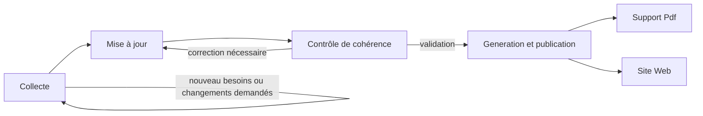

# Manuel de gestion des contenus du CCT

## Processus complet d'intégration et de publication
Le processus est le suivant : 

## Maintien en cohérence du CCT, contrôle et corrections
Le document est contrôlé et maintenu en cohérence par l'equipe d'Architecture d'Entreprise.

Si une erreur est décelée, un relecteur peut soumettre des demandes d'évolutions ou des corrections via [une "issue" publiée sur le dépôt Git](https://github.com/dnum-mi/cct-mi/issues).

## L'édition de contenu
### Qui : Le gestionnaire de contenus
Le CCT est composé d'un ensemble de contenus organisés et dont les porteurs au sein de la DTNUM ont été identifiés. 
Ces porteurs ont pour charge de mettre et de maintenir les contenus qui leur incombent à jour.
Ces porteurs s'engagent à verifier et à modifier, le cas échéant, leurs contenus tous les trois mois.

#### Liste des gestionnaires par contenu
La liste suivante identifie les sous-directions en charge des contenus.
|Zone du CCT|Fiche|entité responsable|
|----|----|----|
|Chapeau|ensemble des elements constitutifs|SDID|
|Environnement numerique de travail|ENT agent|SDENTAT|
|Environnement numerique de travail|ENT developpeur|SDID|
|Environnement numerique de travail|ENT administrateur|SDAS|
|Environnement numerique de travail|Référentiel des produits - Destinés à l'environnement numérique de l'agent|SDENTAT|
|Cloud Native|CCT Cloud Native|SDID|
|Hors Cloud Native|Pilier Fabrique de code - Forge DC|SDENTAT|
|Hors Cloud Native|Pilier Hébergement - Mise en place d'un hébergement Hors Cloud Native|SDAS|
|Socle d'architecture|Pilier Utilisateur - Usager|SDENTAT|
|Socle d'architecture|Pilier Utilisateur - Agent|SDENTAT|
|Socle d'architecture|Pilier Utilisateur - Personne morale|SDENTAT|
|Socle d'architecture|Pilier Utilisateur - CSU d'une application|SDENTAT|
|Socle d'architecture|Pilier Utilisateur - UX et accessibilité|SDID|
|Socle d'architecture|Pilier Données et API - Stratégie API|SDID|
|Socle d'architecture|Pilier Données et API - Concevoir une application orientée données et services|SDID|
|Socle d'architecture|Pilier Données et API - Gestion des échanges|SDID|
|Socle d'architecture|Pilier Données et API - Analyser et valoriser des données|SDID|
|Socle d'architecture|Pilier Données et API - Cycle de vie de la donnée et archivage|SDID|
|Socle d'architecture|Pilier Hébergement - Supervision d'une solution|SDAS|
|Socle d'architecture|Enregistrement d'un élément au registre des identités à visée internationale|SHFD|
|Socle d'architecture|Référentiel des produits - Destinés à l'environnement numérique du développeur|SDID|
|Socle d'architecture|Référentiel des produits - Destinés à l'hébergement et l'exploitation|SDAS|
|Socle d'architecture|Référentiel des produits - Offres de services DTNUM|SDENTAT|
|Socle d'architecture|Guide d’utilisation du CCT dans la passation des marchés publics|SGNM/SAILMI|
|Socle d'architecture|Documentation technique - Dossier d'Architecture Générale (DAG)|SDID|
|Socle d'architecture|Documentation technique - Normalisation des FQDN|SDID|
|Socle de sécurité|Pilier Sécurité - SSI et homologation|MPSSI|
|Socle de sécurité|Pilier Sécurité - Liste des exigences SSI|MPSSI|
|Socle de sécurité|Pilier Sécurité - Gestion des données personnelles|MAQE|
|Socle de sécurité|Référentiel des produits - Destinés à la sécurité des SI|MPSSI|

### Comment : Modalités de saisie

Le responsable peut se connecter sur le dépôt git du CCT. Le rôle "write" lui est attribué.

| Action | Description |
| ------ | ----------- |
| Connexion au dépôt CCT   [Lien CCT](https://github.com/dnum-mi/cct-mi/)| Connexion par votre compte public (préalablement enregistré par l'equipe d'Architecture pour vous donner les droits nécessaires)|
|Créer sa branche de modification|Se positionner sur la branche "Main" ou aller sur [l'espace de gestion des branches](https://github.com/dnum-mi/cct-mi/branches).  Créer une branche (taper le nom dans l'espace de saisie ou faire "New branch") en indiquant la fiche modifiée et datée (ex."20231201_ENT Agent")|
|Choisir et éditer la fiche que vous souhaitez modifier|En naviguant sur votre branche (s'assurer que dans l'url le nom de votre branche est bien le bon. ex : https://github.com/dnum-mi/cct-mi/tree/*nomdevotrebranche* ), se positionner sur le fichier a modifier et cliquer sur l'icone du stylo "Edit this file".  Vous accédez au contenu modifiable de la fiche, en language markdown.  Après toute modification, penser a enregistrer les modifications dans votre branche en cliquant sur "commit changes" (Penser à décrire les modifications apportées au documment)|
|Soumettez votre proposition de modification |Lorsque toutes les modifications apportées à vos contenus sont réalisés, realiser un ["pull resquest"](https://github.com/dnum-mi/cct-mi/pulls)(New pull request) de votre branche vers la branche "Main". (Penser à reporter toutes les modifications apportées a vos documments modifiés dans votre branche) Le contenu soumis passe alors par l'étape de génération du site web pour une publication immédiate sur le site web intranet du CCT.  Avant publication sur le site web internet du CCT, le contenu global sera analysé par l'équipe d'architecture d'entreprise pour s'assurer de la cohérence d'ensemble. Le cas échéant, il vous demanderont de corriger la fiche. Le contenu validé par l'équipe sera ensuite poussé vers l'étape de génération du site web Internet pour publication.|

## L'enrichissement 
### Qui : Les parties prenantes sur chaque contenu
Certains contenus sont à contextualiser vis à vis d'autres organisations rattachés au MIOM.
Les gestionnaire de contenus ont pour charge de collecter et d'intégrer les éléments qui seraient propres à ces parties prenantes (ex. les SSO mis en oeuvres dans les différentes entités organisationnelles) dans les fiches du CCT.

D'autres acteurs peuvent soumettre au travers de requêtes (nommées Issues dans l'espace GIT) des propositions de modification (ex. ajout/remplacement/suppression d'un produit destiné à être utilisé dans un environnement de travail, un outil d'exploitation, etc...) que le gestionnaire de contenu devra analyser et intégrer le cas échéant dans sa documentation.

### Comment : modalités de dépot de contribution
La partie prenante peut se connecter sur le dépôt git du CCT. Le rôle qui lui est attribué sur l'espace est "guest".

| Action | Description |
| ------ | ------ |
| Connexion au dépôt CCT   [Lien Git](https://lien a decrire)| Connexion en accès public  / authentification avec son compte public|
|Ouvrir la page des discussions (un élément de discussion est une "issue")|Choisir "Issues" dans le menu de gauche. La page de discussion vous liste par défaut les «Issues» ouvertes.
|Créer un nouveau fil de discussion|Cliquer sur [New Issue] : un formulaire de saisie s'affiche. Indiquer dans le titre le nom de la fiche ciblée et une synthèse de la mise a jour souhaitée. Dans la description, mettre l'argumentaire voulu (texte à intégrer, ...) Cliquer sur [Submit Issue] pour soumettre la requête.|
|Suites données|Le responsable du contenu ciblé doit prendre en compte la requête.) Après analyse il sera le seul arbitrer sur sa prise en compte dans les prochaines versions officielles du CCT.|

## La publication 
### Automatisation de la publication
Suite à la validation de la cohérence par les équipes d'Architecture d'Entreprise, les contenus sont mis en ligne instantanément.
Ce nouveau contenu est versionné et rendu disponible sur le site du CCT.
Ce contenu est aussi rendu disponible au format PDF. 

