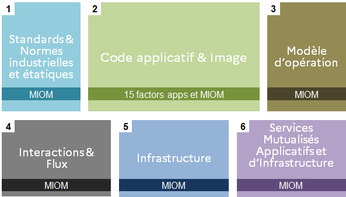

Les exigences du CCT sont classées en 2 niveaux d’exigence (périmètre du Ministère de l’Intérieur) :

- **P**rimordial : L’exigence est impérative et traitée administrativement.
- **I**mportant : Exigence prise en compte pour la notation technique de la solution

Précisions sur le cas de l’exclusion administrative (périmètre du Ministère de l’Intérieur) :

- La non-conformité au cadre de norme entraîne l’exclusion administrative lors du dépouillement et la mise en œuvre des actions de remédiation du marché lors de l’exécution du marché.
- La non-conformité aux exigences d’architecture entraîne l’impossibilité d’utilisation du socle de sécurité associé à l’offre Cloud Native

Par défaut les règles du CCT s’imposent. Elles peuvent être précisées dans le cas d’un appel d'offres dans le règlement de consultation pour le dépouillement des offres et dans le CCAP pour l’exécution du marché. Une demande de dérogation est possible. ( cf paragraphe ad hoc )

Pour information les exigences sont organisées telles que décrites ci-dessous :

1. **Standards & Normes industrielles et étatiques**: ensemble des exigences relatives aux normes de niveau supérieur à respecter pour toute application étatique
2. **Code applicatif & Image**: exigences issues des “15 factors” pour garantir la conception d’une application “Cloud Native”, associées aux exigences minimales permettant de s’intégrer au contexte du Ministère de l’Intérieur
3. **Modèle d’opération**:  _voir le chapitre précédent_
4. **Intéractions & Flux**: exigences d’intégration et d’intéraction inter-applicatives dans le contexte étatique et du Ministère de l’Intérieur
5. **Infrastructure**: exigences et prérequis concernant l’infrastructure sous-jacente (notamment Kubernetes)
6. **Services mutualisés Applicatifs et d'Infrastructure**: exigences d’intégration aux services centralisés du Ministère de l’Intérieur, permettant une homogénéisation de la production, un meilleur contrôle et une maîtrise de la dette technique

